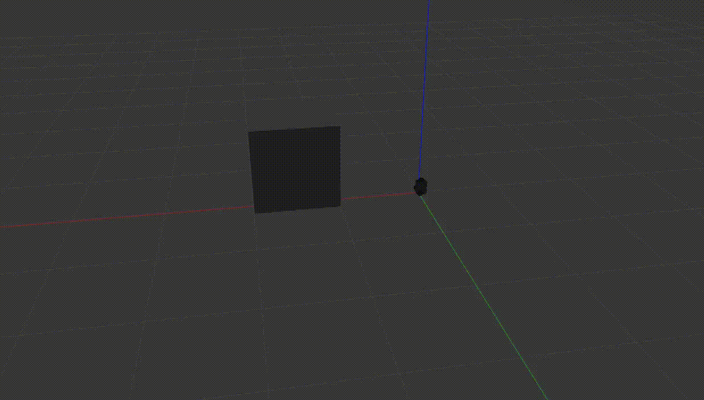

# warehouse robot

## Prerequisites

-turtlebot3, model burger
-ROS noetic 1.15.11
-Ubuntu 20.04 as ROS master

## Description

This is beginning of work on my thesis work for CTU FS

This is project on developing algorithm for turtlebot, to avoide simple obstacle (like square) mainly in the simulation.
This algorithm is working poorly even in simulation, but doing it's main goal - obstacle avoidance. Main problem is odometry, which will be 
fixed with using of SLAM algorithm in the next part of project 'ProjectIII_final'. The following algorithm does not work properly in the real world.

## Illustration of work

More succsessful example of obstacle avoidance is in the .webm file

 / ! 

